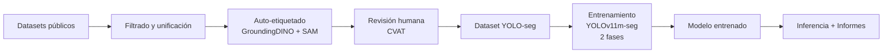

# 🚗 Sistema de Fotoperitación — Detección de Daños en Vehículos

Sistema end-to-end de visión artificial para detectar, segmentar y clasificar daños en vehículos a partir de fotografías, generando un dataset anotado reutilizable e informes de peritación profesionales.

## 🎯 Clases de Daño

| ID | Clase | Descripción |
|----|-------|-------------|
| 0  | `dent` | Abolladuras, golpes, deformaciones de chapa |
| 1  | `scratch` | Arañazos, rozaduras, marcas de pintura |
| 2  | `crack` | Grietas, roturas de plástico/paragolpes |
| 3  | `broken_light` | Faros, pilotos, intermitentes rotos |

> **Excluidos:** pinchazos/neumáticos y lunas/cristales

## 🏗️ Arquitectura



## ⚡ Instalación

```bash
# Crear entorno virtual
python -m venv venv
source venv/bin/activate  # macOS/Linux

# Instalar dependencias
pip install -r requirements.txt

# (Opcional) Para auto-etiquetado con GroundingDINO + SAM
pip install autodistill autodistill-grounded-sam
```

## 🚀 Uso Rápido

### Pipeline completo

```bash
# 1. Descargar y unificar datasets
python scripts/download_datasets.py --datasets vehide,cardd

# 2. Convertir a formato YOLO con splits
python scripts/unify_to_yolo.py

# 3. (Opcional) Auto-etiquetar imágenes adicionales
python scripts/auto_label.py --input data/raw/unlabeled

# 4. (Opcional) Preparar para revisión en CVAT
python scripts/prepare_for_review.py --input data/auto_labeled

# 5. Entrenar modelo (2 fases)
python scripts/train.py

# 6. Evaluar
python scripts/evaluate.py

# 7. Inferencia
python scripts/predict.py --source path/to/image.jpg

# 8. Generar informe de peritación
python scripts/generate_report.py --source path/to/image.jpg
```

## 📁 Estructura del Proyecto

```
Comp_vision/
├── configs/
│   ├── data_config.yaml          # Clases, mappings, splits
│   ├── auto_label_config.yaml    # Config GroundingDINO + SAM
│   └── dataset.yaml              # Config Ultralytics
├── scripts/
│   ├── download_datasets.py      # Descarga datasets públicos
│   ├── unify_to_yolo.py          # COCO → YOLO-seg + splits
│   ├── auto_label.py             # Auto-etiquetado zero-shot
│   ├── prepare_for_review.py     # Exporta para CVAT
│   ├── export_reviewed.py        # Importa revisiones CVAT
│   ├── train.py                  # Entrenamiento 2 fases
│   ├── predict.py                # Inferencia + visualización
│   ├── evaluate.py               # Métricas sobre test set
│   └── generate_report.py        # Informes HTML de peritación
├── data/
│   ├── raw/                      # Datos descargados
│   ├── unified/                  # COCO unificado
│   ├── auto_labeled/             # Salida auto-etiquetado
│   └── final/                    # Dataset YOLO listo
├── runs/                         # Resultados entrenamiento
├── results/                      # Predicciones
├── reports/                      # Informes de peritación
└── evaluation_results/           # Métricas y comparaciones
```

## 📊 Datasets Utilizados

| Dataset | Imágenes | Licencia | Fuente |
|---------|----------|----------|--------|
| VehiDE | ~14,000 | Apache 2.0 | Kaggle |
| CarDD | ~4,000 | Research | HuggingFace |
| SInfo | ~4,300 | CC BY 4.0 | Roboflow |
| SYNDCAR | 245 | CC BY 4.0 | Mendeley |

## 🧠 Modelo

- **Arquitectura:** YOLOv11m-seg (Ultralytics)
- **Entrenamiento:** 2 fases (backbone congelado → fine-tuning completo)
- **Resolución:** 1024px
- **Augmentaciones:** Mosaic, Copy-Paste, MixUp, HSV jitter

## 📄 Licencia

Este proyecto utiliza datasets con diferentes licencias. Consulta cada dataset individual para términos de uso.
