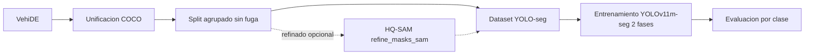

# Sistema de Fotoperitación — Detección de Daños en Vehículos

Sistema de visión por computador para detectar, segmentar y clasificar daños de
aparcamiento en vehículos a partir de fotos, y triar/estimar el coste de cada
siniestro con trazabilidad para un asegurador regulado.

## Clases de daño (4 clases nativas)

| ID | Clase | Descripción |
|----|-------|-------------|
| 0 | `scratch` | Arañazos, rozaduras, marcas de pintura |
| 1 | `dent` | Abolladuras, golpes, deformaciones de chapa |
| 2 | `crack` | Grietas, roturas de plástico/paragolpes |
| 3 | `broken_light` | Faros, pilotos, intermitentes rotos |

Son las 4 clases nativas de VehiDE (`configs/data_config_vehide4.yaml`). Excluidas a
propósito: lunas/cristales y neumáticos (fuera de alcance). Los sub-tipos `paint_chip`
y `puncture` se descartaron: no son distinguibles de forma fiable desde una sola foto
(su versión anterior, generada con CLIP zero-shot, introducía ruido).

## Arquitectura

Pipeline de datos y modelo:



Capa operativa (`assess_claim.py`): quality gate → detección de daño + segmentación →
localización de pieza → estimación de coste → severidad → alertas → agregación
multi-vista → triaje (verde/ámbar/rojo) → salida JSON validada + auditoría sin PII.
El modelo es un componente; las reglas de negocio viven en YAML (deterministas y
auditables) para AI Act / DORA / RGPD.

## Higiene de datos: split sin fuga

El reparto train/val/test agrupa por vehículo (union-find) y deduplica
casi-duplicados por hash perceptual (dHash + BK-tree), asignando grupos enteros a un
solo split. Una auditoría escrita (`leakage_audit.json`) verifica que ningún grupo
cruza splits (`cross_split_groups = 0`). Esto evita la fuga que inflaba las métricas
del enfoque anterior.

## Instalación

```bash
python -m venv venv && source venv/bin/activate
pip install -r requirements.txt
```

## Uso rápido

### En una caja GPU (RunPod), en un comando
```bash
# reconstruye el dataset limpio VehiDE-4 y entrena (2 fases) en tmux
bash setup_gpu.sh --vehide4
```

### Manual, paso a paso
```bash
# 1. Descargar VehiDE (Kaggle)
python scripts/download_datasets.py --datasets vehide --config configs/data_config_vehide4.yaml

# 2. COCO -> YOLO-seg con split agrupado sin fuga
python scripts/unify_to_yolo.py --config configs/data_config_vehide4.yaml \
    --input data/unified_vehide4 --output data/final_vehide4

# 3. Entrenar (2 fases: backbone congelado -> fine-tuning)
python scripts/train.py --data configs/dataset_vehide4.yaml --no-amp --batch 16 --imgsz 1024

# 4. Evaluar (mAP50 y mAP50-95 por clase)
python scripts/evaluate.py --model runs/.../phase2_finetune/weights/best.pt \
    --data configs/dataset_vehide4.yaml
```

### Mejora de etiquetas con SAM (Tier 2, opcional)
```bash
pip install segment-anything-hq "timm<1.0"
# refina los polígonos flojos de VehiDE con HQ-SAM (caja + puntos de centerline)
python scripts/refine_masks_sam.py --input data/unified_vehide4 \
    --output data/unified_vehide4_sam --checkpoint sam_hq_vit_h.pth
```

## Estructura del proyecto

```
Comp_vision/
├── configs/
│   ├── data_config_vehide4.yaml    # VehiDE-4: clases, mapeo, split sin fuga
│   ├── dataset_vehide4.yaml        # config Ultralytics (entrenamiento)
│   └── ...                         # baremo, precios, piezas, reglas de negocio
├── scripts/
│   ├── download_datasets.py        # Descarga datasets (VehiDE, CarDD, ...)
│   ├── unify_to_yolo.py            # COCO -> YOLO-seg + split agrupado sin fuga
│   ├── refine_masks_sam.py         # Tier 2: refinado de máscaras con HQ-SAM
│   ├── train.py                    # Entrenamiento 2 fases (+ --cache/--workers/--mask-ratio)
│   ├── evaluate.py                 # Métricas mAP50 y mAP50-95 por clase
│   ├── predict.py                  # Inferencia + visualización
│   ├── assess_claim.py             # Orquestador operativo (siniestro -> decisión)
│   └── quality_gate.py, triage.py, estimate_cost.py, ...   # capa operativa
├── business_rules/ schemas/        # reglas YAML y schemas de salida
├── data/                           # datos (gitignored)
├── models/ runs/ evaluation_results/   # pesos y métricas (gitignored)
└── setup_gpu.sh                    # provisión de caja GPU + entrenamiento
```

## Datos

Piloto sobre **VehiDE** (Kaggle, Apache 2.0) en exclusiva, con sus etiquetas nativas
(sin re-tipado, sin mezcla multi-fuente). El tooling de descarga también soporta CarDD,
Roboflow y SYNDCAR, pero el piloto actual no los usa para mantener los datos limpios.

## Modelo

- Arquitectura: YOLOv11m-seg (Ultralytics)
- Entrenamiento: 2 fases (backbone congelado -> fine-tuning completo)
- Resolución: 1024px

## Licencia y aviso

El stack YOLO (Ultralytics) es **AGPL-3.0**: un uso comercial requiere licencia
Enterprise o migrar a un modelo permisivo (RT-DETR/DEIM/DINOv2/SAM son Apache/MIT).
Los datasets tienen licencias propias; consulta cada uno.
