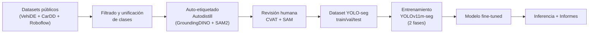
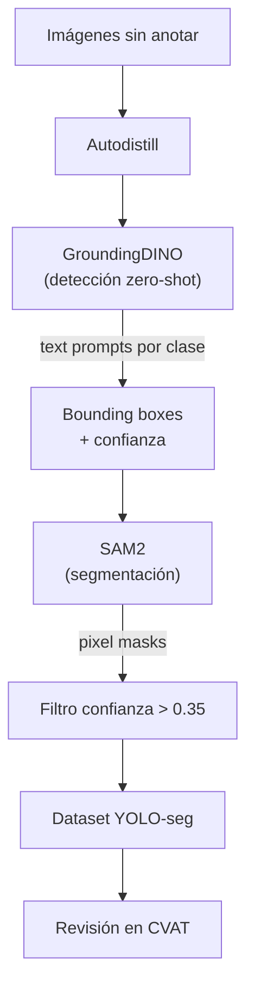
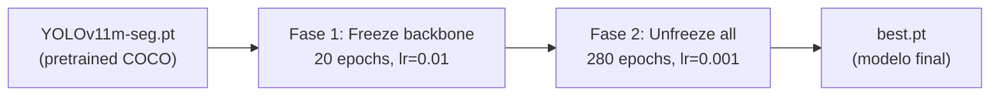

# Sistema de Fotoperitación: Detección y Segmentación de Daños en Vehículos

Sistema end-to-end para detectar, segmentar y clasificar daños simples en vehículos a partir de imágenes, generando un dataset anotado reutilizable.

## Alcance

**Daños incluidos (4 clases):**
| Clase | ID | Descripción |
|---|---|---|
| `dent` | 0 | Abolladuras, golpes, deformaciones de chapa |
| `scratch` | 1 | Arañazos, rozaduras, marcas de pintura |
| `crack` | 2 | Grietas, roturas de plástico/paragolpes |
| `broken_light` | 3 | Faros, pilotos, intermitentes rotos |

**Excluidos explícitamente:** pinchazos/neumáticos (`flat_tire`) y lunas/cristales (`glass_shatter`)

---

## Arquitectura del Sistema



---

## User Review Required

> [!IMPORTANT]
> **Elección de modelo base**: Recomiendo **YOLOv11m-seg** (~10M params). El modelo `s` (~2.6M) es más resistente al overfitting pero menos preciso en daños finos. El modelo `x` (~62M) sobreajustaría con <5K imágenes. Si tienes >10K imágenes revisadas, podemos escalar a `l` o `x`.

> [!WARNING]
> **GPU necesaria**: El entrenamiento requiere GPU (mín. 8GB VRAM). Recomiendo Google Colab Pro (T4/A100) o una RTX 3060+ local. Autodistill (GroundingDINO+SAM2) necesita ~12GB VRAM, o se puede correr en Colab.

> [!IMPORTANT]
> **Herramienta de anotación**: Recomiendo **CVAT** (open-source, self-hosted con Docker). Tiene la mejor integración con SAM para asistencia AI en la corrección de masks. Alternativa: Label Studio si prefieres workflows más configurables.

## Open Questions

> [!IMPORTANT]
> 1. **¿Tienes acceso a GPU?** (local o cloud — define si usamos Colab o scripts locales)
> 2. **¿Tamaño objetivo del dataset final?** Recomiendo mínimo ~2,000 imágenes revisadas por humano
> 3. **¿Quieres API REST** (FastAPI) para servir predicciones, o solo scripts CLI?
> 4. **¿Despliegue final?** Servidor GPU, edge device, o móvil (afecta el formato de exportación)

---

## Fase 1: Datasets Públicos — Recopilación y Unificación

### Fuentes de datos (priorizadas)

| # | Dataset | Imágenes | Instancias | Formato | Licencia | Rol |
|---|---------|----------|------------|---------|----------|-----|
| 1 | **VehiDE** | 13,945 | 32,000+ | COCO JSON | Apache 2.0 ✅ | **Dataset principal** |
| 2 | **CarDD** (USTC) | 4,000 | 9,000+ | COCO JSON | Research-only ⚠️ | Complemento académico |
| 3 | **SInfo Segmentation** (Roboflow) | 4,303 | Variable | YOLO/COCO | CC BY 4.0 ✅ | Segmentación adicional |
| 4 | **Curacel AI** (Roboflow) | ~2,000 | Variable | YOLO | CC BY 4.0 ✅ | Datos insurtech |
| 5 | **SYNDCAR** (Mendeley) | 245 | Variable | YOLO | CC BY 4.0 ✅ | Parts segmentation |

> [!NOTE]
> **CarDD** requiere solicitar acceso por email a `wangxk0624@mail.ustc.edu.cn`. Alternativamente hay mirrors en HuggingFace (`harpreetsahota/CarDD`) y Kaggle.

### Proceso de obtención y unificación

#### [NEW] [download_datasets.py](file:///Users/borja/Documents/Somniumrema/projects/Comp_vision/scripts/download_datasets.py)
- Descarga automática de VehiDE (Kaggle API), SInfo/Curacel (Roboflow API), SYNDCAR (Mendeley)
- CarDD: instrucciones para descarga manual + script de procesamiento
- **Filtrado**: elimina imágenes etiquetadas con `flat_tire`, `glass_shatter`, `tire flat`, `glass shatter`
- **Remapping unificado** de clases heterogéneas → 4 clases target:

```python
CLASS_MAPPING = {
    # CarDD mapping
    "Dent": "dent",       "Scratch": "scratch",
    "Crack": "crack",     "Lamp Broken": "broken_light",
    "Glass Shatter": None,  # EXCLUIR
    "Tire Flat": None,      # EXCLUIR
    
    # VehiDE / Roboflow mappings
    "dent": "dent",       "bonnet-dent": "dent",    "door-dent": "dent",
    "scratch": "scratch", "door-scratch": "scratch", "paint_damage": "scratch",
    "crack": "crack",     "broken_bumper": "crack",
    "broken_lamp": "broken_light", "headlight": "broken_light",
    "broken_glass": None, "flat_tire": None,  # EXCLUIR
}
```

- Conversión de todas las anotaciones → formato COCO unificado

#### [NEW] [unify_to_yolo.py](file:///Users/borja/Documents/Somniumrema/projects/Comp_vision/scripts/unify_to_yolo.py)
- Convierte COCO JSON unificado → formato YOLO segmentación (txt con polígonos normalizados)
- Genera splits train/val/test (70/20/10)
- Crea `dataset.yaml` compatible con Ultralytics
- Estadísticas de distribución de clases y balanceo

#### [NEW] [data_config.yaml](file:///Users/borja/Documents/Somniumrema/projects/Comp_vision/configs/data_config.yaml)
```yaml
classes:
  0: dent
  1: scratch
  2: crack
  3: broken_light

excluded_classes:
  - glass_shatter
  - flat_tire
  - broken_glass
  - tire_flat

splits:
  train: 0.7
  val: 0.2
  test: 0.1

min_bbox_area: 100        # Filtrar anotaciones demasiado pequeñas (ruido)
min_polygon_points: 4     # Mínimo puntos por polígono
```

---

## Fase 2: Auto-etiquetado con Autodistill (GroundingDINO + SAM2)

Para imágenes sin anotar o para complementar datasets existentes. Usa modelos foundation para generar masks automáticas.

### Pipeline con Autodistill



#### [NEW] [auto_label.py](file:///Users/borja/Documents/Somniumrema/projects/Comp_vision/scripts/auto_label.py)

```python
from autodistill_grounded_sam import GroundedSAM
from autodistill.detection import CaptionOntology

# Ontología de daños para fotoperitación
ontology = CaptionOntology({
    "dent on car body . vehicle dent . panel dent . body damage indentation": "dent",
    "scratch on car paint . paint scratch . key scratch . scrape mark": "scratch",
    "crack on car bumper . plastic crack . broken bumper piece": "crack",
    "broken headlight . broken taillight . smashed car lamp . cracked light": "broken_light",
})

base_model = GroundedSAM(ontology=ontology)

# Generar anotaciones automáticas
base_model.label(
    input_folder="./data/raw/unlabeled",
    output_folder="./data/auto_labeled"
)
```

> [!TIP]
> **Precisión esperada del auto-labeling**: ~70-80%. El 20-30% restante se corrige en la revisión humana (Fase 3). Esto es **mucho más rápido** que anotar desde cero (reducción de ~5x en tiempo de anotación).

#### [NEW] [auto_label_config.yaml](file:///Users/borja/Documents/Somniumrema/projects/Comp_vision/configs/auto_label_config.yaml)
- Prompts optimizados por clase (con sinónimos y variaciones)
- Thresholds de confianza por clase (scratches suelen tener scores más bajos)
- Rutas de entrada/salida
- Batch size y opciones de GPU

---

## Fase 3: Revisión Humana en CVAT

### Setup de CVAT

```bash
# Levantar CVAT con Docker (incluye SAM integration)
docker compose -f docker-compose.yml -f components/serverless/docker-compose.serverless.yml up -d
```

### Workflow de revisión

1. **Importar** anotaciones auto-generadas (COCO JSON) como proyecto CVAT
2. **Usar SAM integrado** en CVAT para corregir masks rápidamente (click para refinar)
3. **Revisar** por prioridad: primero imágenes con scores bajos de confianza
4. **QA**: Segundo revisor valida ~10% de las anotaciones
5. **Exportar** en formato YOLO segmentation

#### [NEW] [prepare_for_review.py](file:///Users/borja/Documents/Somniumrema/projects/Comp_vision/scripts/prepare_for_review.py)
- Ordena imágenes por confianza media (low → high) para priorizar revisión
- Genera thumbnails con overlay de las masks auto-generadas
- Crea proyecto CVAT importable (XML/ZIP)
- Estadísticas de distribución de confianza por clase

#### [NEW] [export_reviewed.py](file:///Users/borja/Documents/Somniumrema/projects/Comp_vision/scripts/export_reviewed.py)
- Importa anotaciones revisadas desde CVAT (exportadas como COCO/YOLO)
- Merge con dataset ya existente (evita duplicados)
- Re-genera splits train/val/test balanceados
- Genera `dataset.yaml` final para Ultralytics
- Report de estadísticas finales del dataset

---

## Fase 4: Entrenamiento del Modelo (2 Fases)

### Estrategia de entrenamiento en 2 fases



> [!TIP]
> **Por qué 2 fases**: Con datasets pequeños (<5K), entrenar todo el modelo de golpe puede destruir los features del backbone pretrained. Congelamos primero para adaptar solo la cabeza de segmentación, luego fine-tuneamos todo con learning rate bajo.

#### [NEW] [train.py](file:///Users/borja/Documents/Somniumrema/projects/Comp_vision/scripts/train.py)
```python
from ultralytics import YOLO

# ═══════════════════════════════════════════
# FASE 1: Backbone congelado (warm-up)
# ═══════════════════════════════════════════
model = YOLO("yolo11m-seg.pt")

model.train(
    data="configs/dataset.yaml",
    epochs=20,
    imgsz=1024,
    batch=8,
    optimizer="AdamW",
    lr0=0.01,
    freeze=10,             # Congela las primeras 10 capas (backbone)
    patience=0,            # No early stopping en fase 1
    project="runs/damage_seg",
    name="phase1_frozen"
)

# ═══════════════════════════════════════════
# FASE 2: Fine-tuning completo
# ═══════════════════════════════════════════
model = YOLO("runs/damage_seg/phase1_frozen/weights/last.pt")

model.train(
    data="configs/dataset.yaml",
    epochs=280,
    imgsz=1024,
    batch=8,
    optimizer="AdamW",
    lr0=0.001,
    lrf=0.01,
    dropout=0.1,
    # Augmentaciones específicas para daños
    mosaic=1.0,
    mixup=0.15,
    copy_paste=0.3,        # Copia daños a otras ubicaciones
    degrees=15,
    translate=0.2,
    scale=0.5,
    flipud=0.0,            # NO voltear vertical (coches siempre upright)
    fliplr=0.5,
    hsv_h=0.015,
    hsv_s=0.7,
    hsv_v=0.4,
    patience=50,           # Early stopping
    project="runs/damage_seg",
    name="phase2_finetune"
)
```

### Aumentación de datos — Estrategia específica para daños

| Técnica | Valor | Motivo |
|---|---|---|
| **Copy-Paste** | 0.3 | Clave: pega daños existentes en otras zonas del vehículo |
| **Mosaic** | 1.0 | Combina 4 imágenes → más contexto y eficiencia |
| **MixUp** | 0.15 | Regularización suave para evitar overfitting |
| **HSV jitter** | h=0.015, s=0.7, v=0.4 | Simula sol/sombra/noche/flash |
| **Scale** | 0.5 | Robustez ante daños a diferentes distancias |
| **Flip horizontal** | 0.5 | Vehículos simétricos |
| **No flip vertical** | 0.0 | Los coches nunca están boca abajo |
| **Rotación** | ±15° | Ángulos reales de fotografía |

> [!NOTE]
> **Augmentación avanzada (opcional)**: Se puede complementar con imágenes sintéticas generadas con ControlNet/Stable Diffusion para clases infrarrepresentadas. Esto queda fuera del alcance inicial pero es una opción para mejorar rendimiento.

#### [NEW] [dataset.yaml](file:///Users/borja/Documents/Somniumrema/projects/Comp_vision/configs/dataset.yaml)
```yaml
path: /Users/borja/Documents/Somniumrema/projects/Comp_vision/data/final
train: images/train
val: images/val
test: images/test

names:
  0: dent
  1: scratch
  2: crack
  3: broken_light
```

---

## Fase 5: Inferencia, Evaluación e Informes

#### [NEW] [predict.py](file:///Users/borja/Documents/Somniumrema/projects/Comp_vision/scripts/predict.py)
- Inferencia sobre imágenes individuales, directorios o URLs
- Genera visualizaciones con máscaras coloreadas por tipo de daño:
  - 🔴 `dent` → rojo
  - 🟡 `scratch` → amarillo
  - 🔵 `crack` → azul
  - 🟣 `broken_light` → morado
- Exporta resultados en JSON estructurado:
```json
{
  "image": "IMG_001.jpg",
  "damages": [
    {"class": "dent", "confidence": 0.92, "area_px": 15420, "area_pct": 2.3,
     "bbox": [120, 340, 280, 510], "mask_polygon": [[...]]},
    {"class": "scratch", "confidence": 0.87, "area_px": 3200, "area_pct": 0.5,
     "bbox": [400, 200, 650, 220], "mask_polygon": [[...]]}
  ],
  "total_damage_area_pct": 2.8
}
```

#### [NEW] [evaluate.py](file:///Users/borja/Documents/Somniumrema/projects/Comp_vision/scripts/evaluate.py)
- Evaluación completa sobre test set:
  - mAP@50, mAP@50:95 (boxes y masks)
  - Precision, Recall, F1 por clase
  - Matriz de confusión
  - Curvas PR por clase
- Visualización side-by-side: ground truth vs predicción
- Análisis de errores: falsos positivos/negativos más frecuentes

#### [NEW] [generate_report.py](file:///Users/borja/Documents/Somniumrema/projects/Comp_vision/scripts/generate_report.py)
- Genera informe de peritación por imagen (HTML/PDF):
  - Imagen original + imagen con masks superpuestas
  - Tabla de daños: tipo, confianza, área estimada, ubicación
  - Resumen de severidad
- Formato compatible con flujos de seguros

---

## Estructura del Proyecto

```
Comp_vision/
├── configs/
│   ├── data_config.yaml          # Mapping de clases, splits, filtros
│   ├── auto_label_config.yaml    # Config Autodistill (prompts, thresholds)
│   └── dataset.yaml              # Config Ultralytics para training
├── scripts/
│   ├── download_datasets.py      # Descarga VehiDE, CarDD, Roboflow, SYNDCAR
│   ├── unify_to_yolo.py          # COCO → YOLO-seg, splits, estadísticas
│   ├── auto_label.py             # Autodistill: GroundingDINO + SAM2
│   ├── prepare_for_review.py     # Exporta para CVAT con priorización
│   ├── export_reviewed.py        # Importa revisiones, regenera dataset
│   ├── train.py                  # Entrenamiento 2 fases YOLOv11m-seg
│   ├── predict.py                # Inferencia + visualización + JSON
│   ├── evaluate.py               # Métricas completas sobre test set
│   └── generate_report.py        # Informes de peritación HTML/PDF
├── data/
│   ├── raw/                      # Imágenes descargadas sin procesar
│   │   ├── vehide/
│   │   ├── cardd/
│   │   └── roboflow/
│   ├── unified/                  # COCO unificado (4 clases)
│   ├── auto_labeled/             # Salida de Autodistill
│   ├── reviewed/                 # Anotaciones corregidas en CVAT
│   └── final/                    # Dataset listo para entrenar
│       ├── images/
│       │   ├── train/
│       │   ├── val/
│       │   └── test/
│       └── labels/
│           ├── train/
│           ├── val/
│           └── test/
├── runs/                         # Resultados de entrenamiento (Ultralytics)
│   └── damage_seg/
│       ├── phase1_frozen/
│       └── phase2_finetune/
├── notebooks/
│   └── eda.ipynb                 # Exploración del dataset
├── requirements.txt
└── README.md
```

---

## Dependencias

#### [NEW] [requirements.txt](file:///Users/borja/Documents/Somniumrema/projects/Comp_vision/requirements.txt)
```
# Core
ultralytics>=8.3.0
torch>=2.1.0
torchvision>=0.16.0

# Auto-labeling
autodistill
autodistill-grounded-sam
supervision>=0.19.0

# Dataset processing
pycocotools
kaggle
roboflow

# Visualization & reporting
matplotlib
seaborn
Pillow
opencv-python-headless
jinja2           # Para informes HTML
weasyprint       # Para exportar a PDF (opcional)

# Utilities
pyyaml
tqdm
rich             # Pretty CLI output
```

---

## Comparativa de Arquitecturas Evaluadas

| Modelo | Params | mAP@50 (est.) | Inferencia | Transfer Learning | Complejidad | Veredicto |
|---|---|---|---|---|---|---|
| **YOLOv11m-seg** ⭐ | ~10M | Alto | ~30 FPS | 3 líneas de código | Baja | **RECOMENDADO** |
| YOLOv11s-seg | ~2.6M | Medio-Alto | ~44 FPS | 3 líneas | Baja | Si dataset <2K |
| YOLOv11x-seg | ~62M | Muy alto | ~15 FPS | 3 líneas | Baja | Si dataset >10K |
| Detectron2 Mask R-CNN | ~44M | Muy alto | ~5 FPS | Complejo | Alta | Solo si masks perfectas |
| SAM2 | ~300M | N/A | ~2 FPS | No clasificable | N/A | Solo para anotación |

---

## Verification Plan

### Automated Tests
```bash
# 1. Verificar descarga y estructura del dataset
python scripts/download_datasets.py --dry-run

# 2. Verificar unificación y estadísticas
python scripts/unify_to_yolo.py --stats-only

# 3. Probar auto-etiquetado con 10 imágenes sample
python scripts/auto_label.py --input data/raw/sample --limit 10

# 4. Validar formato de anotaciones con Ultralytics
python -c "from ultralytics import YOLO; YOLO('yolo11n-seg.pt').val(data='configs/dataset.yaml')"

# 5. Sanity check de entrenamiento (5 epochs)
python scripts/train.py --epochs 5 --imgsz 640 --batch 4 --phase1-only

# 6. Entrenamiento completo (2 fases)
python scripts/train.py

# 7. Evaluación sobre test set
python scripts/evaluate.py --model runs/damage_seg/phase2_finetune/weights/best.pt

# 8. Generar informe sample
python scripts/generate_report.py --image data/final/images/test/sample.jpg
```

### Manual Verification
- Revisar visualmente 50 predicciones aleatorias del test set
- Verificar que NO se detectan daños tipo tire/glass (clases excluidas)
- Confirmar que las masks siguen contornos reales del daño (no rectangulares)
- Validar informe de peritación generado (formato, contenido, legibilidad)
- Comparar métricas por clase para identificar clases débiles
